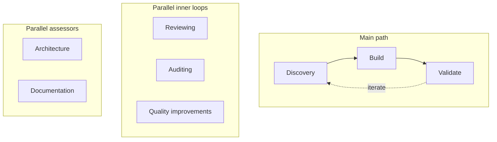

## Hi, I'm Gonzo

Dev in Seattle. Into AI, automation, and building things that turn messy goals into clear plans. I use **Codex** for agentic development.

I'm happiest when the system handles the tedious bits so people can focus on the parts that actually need a human—and I like it when those systems help real people (and their pets) instead of just moving pixels around.

**Currently:** Building a platform that turns natural-language goals into structured, executable plans; side projects include a multi-tenant clinic system (Azure, native iOS) and local dev orchestration (Firebase + Redis).

- 🗺️ **Goal → plan:** You describe a goal in plain language; the system returns a structured plan (phases, steps, roles). Steps can be human-only, automated, or mixed—automation is wired as tools, agents, and webhooks. Under the hood: a LangGraph pipeline (normalize → generate → attach actions), streaming job progress in the UI, and connectors that plug in external workflows and data.
- 🔧 **Local dev orchestration:** An Electron app that runs Firebase emulator and Redis (Docker) with one-click start/restart and live status, so the rest of the stack stays out of your way.
- ☁️ **Multi-tenant clinic platform (side project):** Native iOS for owners (offline-first), staff web portal, EMR, appointments, billing, telemedicine, and inventory. Built on Azure (.NET 8, PostgreSQL, Service Bus, Entra), multi-tenant by design, with Bicep/azd for infra.

### Agentic loop (Codex SDLC)

I'm playing with **agentic loops**—scheduled automations, skills, and human-in-the-loop handoffs—to see where "AI as a teammate" is actually going. Not one-shot prompts, but a repeatable loop: **Discovery → Build → Validate**, with **parallel inner loops** (reviewing, auditing, quality improvements) and **parallel assessors** (architecture, documentation) running alongside. The diagram below is the loop I run. It's my working map for how AI-assisted building is evolving.

