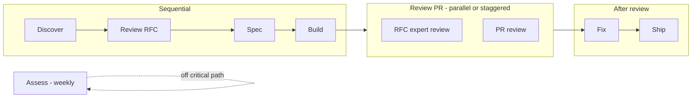

## Hi, I'm Gonzo

Dev in Seattle. Into AI, automation, and building things that turn messy goals into clear plans. I use **Codex** for agentic development.

**Currently:** AI plan automation, dev tooling, healthcare & vet platforms.

- Turning natural language into structured, executable plans
- Dev tooling for Firebase, Redis, and local workflows
- Work in healthcare and veterinary platforms
- FOIA-style connectors, queues, and streaming progress to the UI
- Cloud-native clinic platform: Azure, .NET 8, native iOS (Swift/SwiftUI), PostgreSQL, multi-tenant, EMR, telemedicine, Bicep/azd

### Agentic loop (Codex SDLC)

