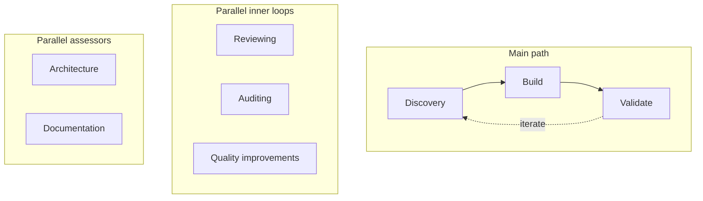

## Hi, I'm Gonzo

Dev in Seattle. I turn messy goals into clear plans—and I like it when the system does the tedious work so people (and their pets) can do the rest. I use **Codex** for agentic development.

**Right now:** Goal-to-plan platform · Health & productivity app (iOS + Azure) · Clinic platform & dev tooling on the side

---

**What I'm building**

- 🗺️ **Goal → plan** — Plain language in, structured plans out. LangGraph, connectors, streaming progress. Human + automation in the same loop.
- 📱 **Health & insights** — iOS + Azure. Energy, calendar, health, AI copilot. Keychain to Key Vault, device to cloud.
- 🔧 **Dev orchestration** — One-click Firebase + Redis. Electron, so you can forget the plumbing.
- ☁️ **Clinic platform (side)** — Multi-tenant. iOS + web, EMR to telemedicine. Azure, Bicep, built to scale.

---

### Agentic loop

I run **Discovery → Build → Validate** with parallel review, audit, and quality—plus architecture and docs as assessors. Below is the map.

