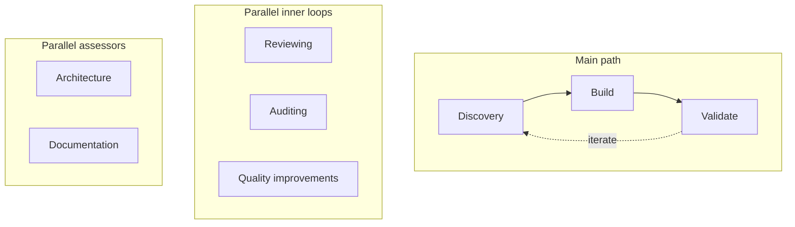

## Hi, I'm Gonzo

Dev in Seattle. Into AI, automation, and building things that turn messy goals into clear plans. I use **Codex** for agentic development.

I'm happiest when the system handles the tedious bits so people can focus on the parts that actually need a human—and I like it when those systems help real people (and their pets) instead of just moving pixels around.

**Currently:** AI plan automation, dev tooling, healthcare & vet platforms.

- 🗺️ Turning natural language into structured, executable plans
- 🔧 Dev tooling for Firebase, Redis, and local workflows
- 🐾 Healthcare & vet platforms (side projects)
- ⚡ Goals → plans with LangGraph; connectors, queues, and streaming progress in the UI
- ☁️ Cloud-native clinic platform: Azure, .NET 8, native iOS (Swift/SwiftUI), PostgreSQL, multi-tenant, EMR, telemedicine, Bicep/azd

### Agentic loop (Codex SDLC)

I'm playing with **agentic loops**—scheduled automations, skills, and human-in-the-loop handoffs—to see where "AI as a teammate" is actually going. Not one-shot prompts, but a repeatable loop: **Discovery → Build → Validate**, with **parallel inner loops** (reviewing, auditing, quality improvements) and **parallel assessors** (architecture, documentation) running alongside. The diagram below is the loop I run. It's my working map for how AI-assisted building is evolving.

