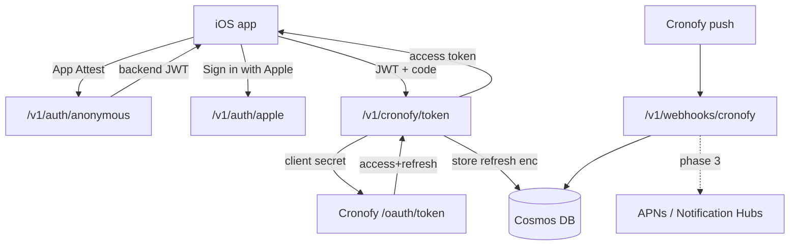

# Convene Backend — Architecture & Design

The backend is a thin, security-focused **Cronofy OAuth broker** plus the
account/subscription brain for the iOS app. It holds the Cronofy client secret
and per-user refresh tokens, exchanges/refreshes access tokens, and (later)
ingests Cronofy RSVP webhooks to drive live updates.

> The iOS app and `CalendarSyncProvider` live in `../ios-meeting-scheduler`.
> This service implements the endpoints behind `ConveneBackendClient` there.

## Stack (decided)

| Concern | Choice | Notes |
| --- | --- | --- |
| Compute | **Azure Functions, Flex Consumption** | C# **isolated worker, .NET 10** (in-process retires 2026‑11‑10). |
| Gateway | **APIM, Consumption tier** | `sku: Consumption`, `capacity: 0`. JWT validation, rate limiting, facade. |
| Data | **Cosmos DB for NoSQL, serverless** | Identity-based connection (no keys). Simple key lookups. |
| Secrets | **Key Vault + Managed Identity** | Cronofy client secret, signing keys. Key Vault references / RBAC. |
| Telemetry | **Application Insights** (+ Log Analytics) | Identity-based ingestion where possible. |
| IaC | **Bicep** | `infra/main.bicep`. |
| CI/CD | **GitHub Actions + OIDC** | Federated credentials, no stored Azure secret. |

## Tiered auth (anonymous-first, optional Apple upgrade)

Polling is fully client-side and needs no backend. The backend is reached only
when a user connects a calendar — at which point we must bind a refresh token to
*some* principal. A wide-open exchange endpoint would let anyone mint Cronofy
connections and burn the Cronofy quota, so even the anonymous tier is gated.

| Tier | Identity | Unlocks | Mechanism |
| --- | --- | --- | --- |
| **Anonymous** (default) | Per-install device principal | Connect a calendar, create events on *your own* calendars | **App Attest** proves a genuine, untampered install → backend issues a short-lived JWT. No login, no PII. |
| **Apple** (upgrade) | Apple `sub` | Meeting **broadcasting** (live RSVP across participants), account management, cross-device/reinstall persistence | **Sign in with Apple** identity token verified against Apple's JWKS; links/elevates the principal. |
| **Subscriber** | Apple + entitlement | Paid features | **StoreKit 2** on device; entitlement validated server-side via App Store Server API / Server Notifications V2. |

Anonymous identity is device-scoped, so it's lost on reinstall — which is the
natural reason to prompt Sign in with Apple. The auth resolver is a single
middleware (`AuthenticationMiddleware` + `IPrincipalResolver`) so the mechanism
is swappable.

## Endpoints

All under APIM, prefix `/v1`. JSON keys match the Swift client exactly
(`accountID`, `redirectURI`, `accessToken`, `expiresIn`, `providerName`).

| Method + path | Auth | Purpose |
| --- | --- | --- |
| `POST /v1/auth/anonymous` | App Attest | Register/attest device key → issue anonymous JWT |
| `POST /v1/auth/apple` | JWT + Apple token | Link/elevate principal to Apple identity |
| `POST /v1/cronofy/token` | JWT | Exchange Cronofy `code` → store refresh, return access token |
| `POST /v1/cronofy/token/refresh` | JWT | Refresh access token from stored refresh token |
| `POST /v1/webhooks/cronofy` | Cronofy HMAC | Ingest RSVP/event changes (phase 3 fans out to APNs) |
| `POST /v1/subscriptions/apple/notifications` | Apple signed | App Store Server Notifications V2 (deferred) |

## Data model (Cosmos NoSQL)

| Container | Partition key | Item |
| --- | --- | --- |
| `principals` | `/id` | `{ id, type: anonymous\|apple, appleSub?, attestKeyId?, subscription?, createdAt }` |
| `cronofyAccounts` | `/principalId` | `{ id (cronofy account_id), principalId, refreshTokenEnc, dataCenter, scope, createdAt }` |
| `eventMappings` | `/principalId` | `{ id (event id), principalId, cronofyAccountId, conversationRef?, attendees[] }` (broadcasting) |

Refresh tokens are **envelope-encrypted** with a Key Vault key before storage —
they are bearer credentials to a user's calendar.

## Security posture

- Functions has a **system-assigned managed identity**; it reads the Cronofy
  secret from Key Vault and connects to Cosmos and Storage **without keys**
  (`allowSharedKeyAccess: false`, Cosmos data-plane RBAC).
- APIM `validate-jwt` policy rejects unauthenticated calls before they hit a
  Function. The webhook endpoint is excluded from JWT and instead verified by
  Cronofy's HMAC signature.
- Least-privilege role assignments only (Key Vault Secrets User, Cosmos Built-in
  Data Contributor, Storage Blob Data Owner for deployment container).

## Phasing

1. **Phase 1 (this scaffold)** — IaC, Functions skeleton, Cronofy token
   exchange/refresh, anonymous + Apple auth structure. App Attest / Apple JWKS
   verification stubbed with clear TODOs (crypto deferred, not faked).
2. **Phase 2** — real App Attest attestation/assertion verification; Apple
   identity-token verification against JWKS; envelope encryption wired to Key Vault.
3. **Phase 3** — Cronofy webhook → RSVP fan-out via APNs/Notification Hubs;
   StoreKit subscription validation.

## Honesty

Authored without a .NET SDK or Azure CLI in this environment — **not built and
not `bicep build`-validated**. Resource schemas were checked against current
Microsoft Learn docs (Flex Consumption `functionAppConfig`; APIM Consumption
`sku`). Expect first-build/first-deploy fixes.
