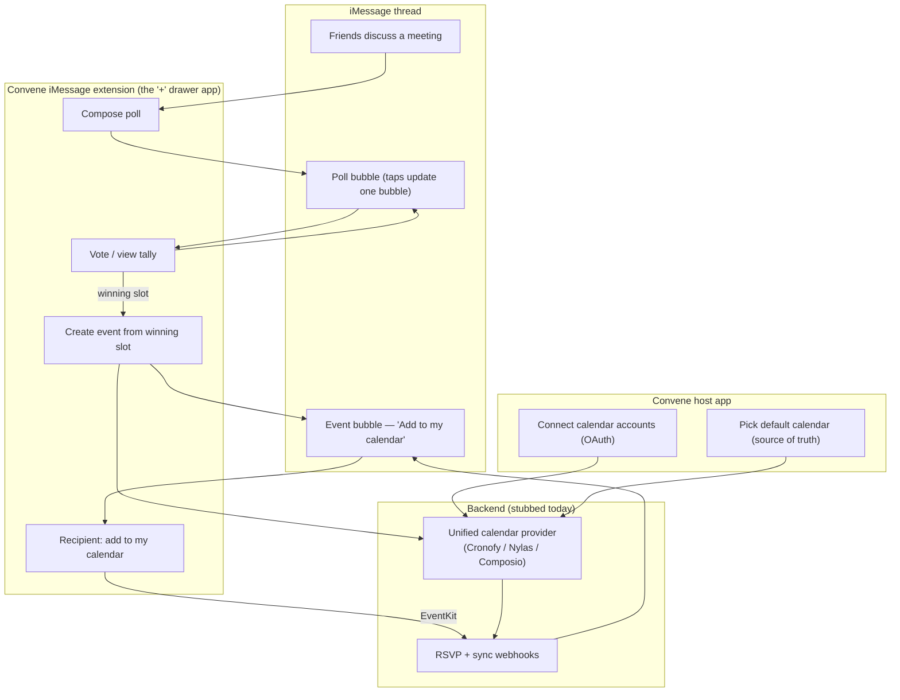

# Convene — Architecture & Technical Design

Convene is an iOS app + iMessage app extension that lets you (1) run a date/time
**poll** inside an iMessage thread, then (2) turn the winning slot into a
**calendar event** that syncs to all of the organizer's calendars and that any
recipient can add to their own calendar with one tap.

This document is the design of record. The accompanying scaffold implements the
client structure and a stubbed backend; the real cross‑provider backend is a
later phase (see [Phasing](#phasing)).

---

## 1. The user flow (and where each piece lives)



| Step in your description | Where it runs | Key API |
| --- | --- | --- |
| Talking in iMessage | Messages app | — |
| "+ button" → open Convene | iMessage app extension | `MSMessagesAppViewController` |
| Create a poll | Extension compose UI | `MSMessage` + `MSMessageTemplateLayout` |
| People vote in‑thread | Extension, tapped from bubble | `MSSession` (collapses into one bubble) |
| Confirm winning date | Extension `PollEngine` | local tally |
| Create + share event | Extension, then backend | `EventKit` (local) + unified API (remote) |
| Sync to all my calendars | Backend | unified provider (Cronofy/Nylas) |
| Recipient one‑tap add | Extension on their device | `EventKit`, or `.ics` universal link fallback |
| RSVP / participant tracking | Backend | unified provider webhooks |

---

## 2. Targets

Three targets, declared in `project.yml` (XcodeGen):

1. **Convene** (host app, SwiftUI) — onboarding, OAuth account connection,
   choosing the default ("source of truth") calendar, settings.
2. **MessagesExtension** (`.appex`) — the actual iMessage experience: poll
   compose/vote, event compose, recipient "add to my calendar".
3. **ConveneKit** (shared framework) — models, the poll engine, the message
   URL codec, the calendar/auth/backend service protocols and stubs. Everything
   testable lives here.

The app and the extension communicate through an **App Group**
(`group.com.davidgonzalez.convene`) for shared state (connected accounts,
default‑calendar choice) and a shared **Keychain** access group for tokens.

---

## 3. How messages carry state (the core trick)

iMessage app messages are interactive `MSMessage` objects whose payload is
encoded in `MSMessage.url` as query items (Apple's documented pattern — see the
`IceCreamBuilder` sample). The bubble's *appearance* is a
`MSMessageTemplateLayout`; the *data* is the URL.

- **Poll message** — URL encodes: poll id, title, candidate slots, and the
  current tally. Tapping the bubble opens the extension into the vote view.
- **Voting** — when a recipient votes, the extension sends an updated
  `MSMessage` **on the same `MSSession`**. iMessage replaces the existing bubble
  instead of appending, so the thread shows one live, updating poll.
- **Event message** — URL encodes: event id, title, start/end, location,
  organizer, and an `.ics`/universal‑link reference. Tapping shows "Add to my
  calendar".

`ConveneKit/Models/ConveneMessage.swift` is the typed payload;
`MessageURLCodec` round‑trips it to/from `URLComponents`. This keeps the
extension free of stringly‑typed URL parsing.

> Why URL‑encoded state and not "just call the backend"? Because polls and
> events must work for recipients who **don't have the app installed** — the
> bubble still renders (template layout) and the `.ics` universal link still
> adds the event. The backend is an enhancement, not a hard dependency, for the
> recipient side.

---

## 4. Calendar sync & the "one for all" provider question

You asked whether **Composio** (or similar) can give a single integration for
all providers. Yes — a unified layer is the right call. Recommendation:

| Option | Built for | Calendar fit | Notes |
| --- | --- | --- | --- |
| **Cronofy** | Unified *calendar* + scheduling API | ★★★ | Free/busy, availability, RSVP, `.ics`, push sync. Closest to this flow. |
| **Nylas** | Unified calendar + email API | ★★★ | Calendar + participants + webhooks. |
| **Composio** | AI‑agent *tool‑calling* across SaaS | ★★ | Has Google Calendar / Outlook, but oriented to agent tools, not calendar sync primitives. Workable as a swap‑in. |
| Direct (Google Calendar API + MS Graph + CalDAV) | — | ★ | Most control, most work, three OAuth flows to maintain. |

**Decision: Cronofy.** It's the only option that requires *no* per‑provider
OAuth app and *no* Google/Microsoft production verification — you register one
app in the Cronofy dashboard and use its client id/secret. The work is still
abstracted behind `CalendarSyncProvider`, so Nylas/Composio remain drop‑in
swaps, but `CronofyCalendarSyncProvider` is the implemented path.

```
CalendarSyncProvider (protocol)
 ├─ EventKitCalendarService        // on‑device iCloud/local, no backend needed
 ├─ CronofyCalendarSyncProvider    // REAL: Cronofy REST (chosen provider)
 └─ StubCalendarSyncProvider       // offline fallback when Cronofy isn't configured
```

The app calls Cronofy **directly** with a short‑lived access token; the backend
exists only to exchange/refresh tokens (it holds the client secret) and to
receive RSVP push notifications. `CalendarProviderFactory` returns the real
Cronofy provider when `CronofyConfig` is configured and a token is present,
otherwise the stub — so the project builds and runs before any Cronofy account
exists.

**Default calendar = source of truth.** The organizer designates one connected
calendar as the default. The event is created there (it owns the attendee list
and RSVP state) and mirrored read‑only to the organizer's other calendars.
Attendee RSVP updates flow back via the provider's webhooks → backend → an
updated event bubble.

---

## 5. Auth (Cronofy hosted)

- The host app opens **Cronofy hosted auth** in `ASWebAuthenticationSession`
  (`app.cronofy.com/oauth/authorize`). The user picks Google/Outlook/iCloud
  *inside* Cronofy's flow — one connect, no per‑provider screens.
  (`CronofyAuthCoordinator` + `CronofyAuthSession`.)
- The redirect returns a one‑time `code` to the `convene://oauth/cronofy`
  callback. The app sends it to the backend, which exchanges it at
  `/oauth/token` **using the client secret** and returns a short‑lived access
  token (`API.CronofyExchangeRequest/Response`).
- `CronofyTokenStore` caches the access token (shared with the extension) and
  asks the backend to refresh it when it expires. **Scaffold caveat:** tokens
  sit in App Group `UserDefaults` today; production must use the shared Keychain
  access group (already in the entitlements).
- Register the redirect URI and your client id in the Cronofy dashboard, then
  set `CronofyConfig.shared.clientID`.

---

## 6. Capabilities / entitlements required

- **App Groups** — `group.com.davidgonzalez.convene` (app ↔ extension state).
- **Keychain Sharing** — shared access group for tokens.
- **iMessage app** — the extension's `NSExtension` point.
- **EventKit usage strings** — `NSCalendarsUsageDescription` (and full‑access
  key on iOS 17+: `NSCalendarsFullAccessUsageDescription`).
- **Associated Domains** — `applinks:` for the `.ics` "add to calendar"
  universal link fallback.

---

## 7. Module map

```
Sources/
  App/                      Convene host app (SwiftUI)
  MessagesExtension/        MSMessagesAppViewController + compose/vote/event UI
  Shared/ (ConveneKit)
    Models/                 Poll, MeetingEvent, Attendee, ConveneMessage
    Poll/                   PollEngine (tally + winning slot)
    Calendar/               CalendarSyncProvider, EventKit + stub, coordinator,
                            factory, selection store
    Calendar/Cronofy/       Config, auth session, REST provider, token store
    Backend/                ConveneBackendClient (Cronofy OAuth broker), stub, DTOs
    Util/                   MessageURLCodec, date helpers
Tests/
  ConveneKitTests/          PollEngine + codec unit tests
```

---

## 8. Phasing

1. **Phase 0 (this scaffold)** — targets, models, poll engine, message codec,
   EventKit local writes, host‑app onboarding shell, **real Cronofy REST
   provider + hosted‑auth wiring** behind a stubbed token broker.
2. **Phase 1** — stand up the backend's two OAuth endpoints (`/oauth/token`
   exchange + refresh) with the Cronofy client secret; set `CronofyConfig`
   client id. End‑to‑end create + sync on a real Google/Outlook account.
3. **Phase 2** — `.ics` universal‑link generation for recipients without the
   app; Keychain‑backed token storage.
4. **Phase 3** — Cronofy RSVP push notifications → backend webhook → live
   event‑bubble updates; participant status surfaced in the bubble.

---

## 9. Known constraints / honesty

- This scaffold was authored in a Linux session **without Xcode**; it has not
  been compiled. Generate the project with `xcodegen generate` and build in
  Xcode. Treat first‑build fixes as expected.
- `EventKit` only sees calendar accounts already configured on the device.
  True cross‑provider sync and participant tracking **require the backend** —
  there is no on‑device‑only path to it.
- Recipients without Convene still get a rendered bubble and the `.ics`
  fallback, but not live RSVP/voting collapse into a single bubble (that needs
  the extension on their device).
